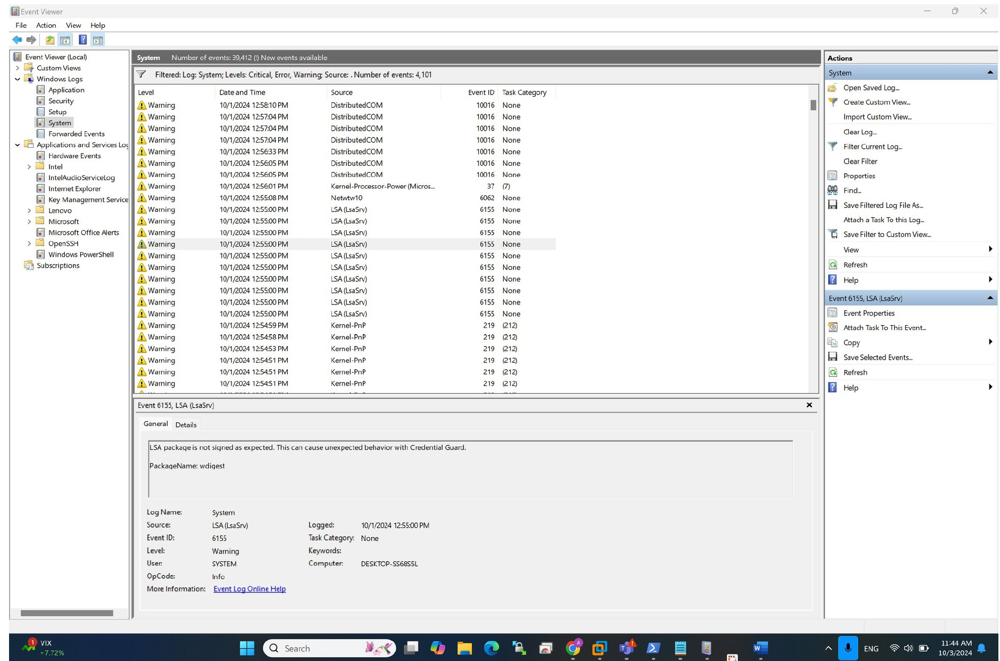
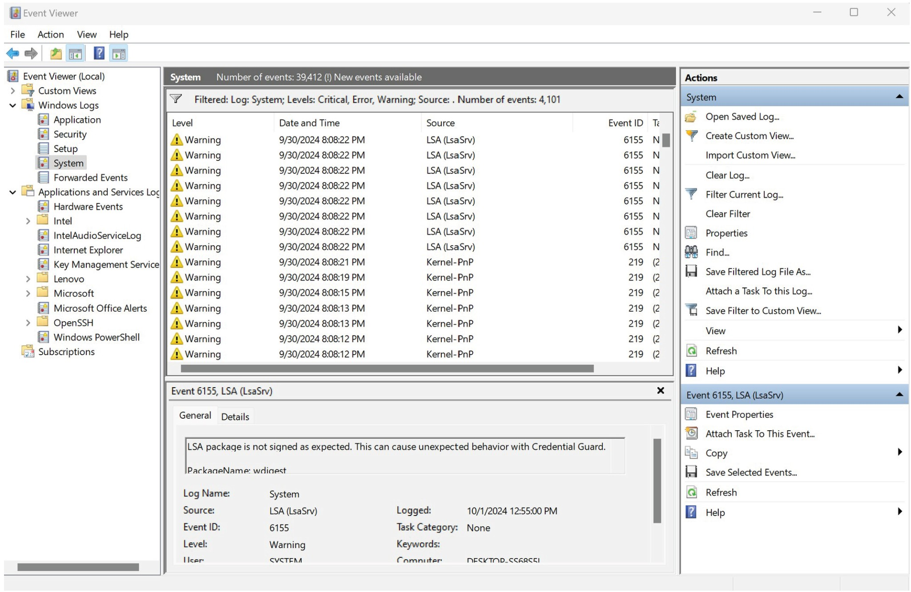

# Windows-Event-Log-Analysis-and-System-Monitoring
# Event Log Analysis and Insights

# Lab: Analyzing Windows Event Logs

## Objectives
This lab will guide you through the process of:
1. Examining existing event logs.
2. Locating and examining event logs that are not in `.evtx` format.
3. Summarizing the presence or absence of event log indicators on your system.

By the end of this exercise, you will gain hands-on experience in analyzing Windows event logs for system and security monitoring.

---

## Pre-requisites
To successfully complete this lab, you should have:
- Basic knowledge of the Windows operating system.
- Familiarity with using the Command Prompt or PowerShell.
- Access to a Windows computer with administrative privileges.

---

## Materials Needed
- **A Windows computer** (Windows 10 or later is preferred).
- **Notebook or text editor** for taking notes and documenting observations.

## Part 1: Event Log Observations and Analysis

#### 1. Which event types (Error, Warning, Information) are most frequent?
**Warnings:**
- The most frequent event type is **Warning**.  
Warnings were frequent from these sources:
  - **DistributedCOM (Event ID: 10016)** – occurred multiple times.
  - **LsaSrv (LSA)**  
  - **Kernel-PnP (Event ID: 219)**  
  - **Win32k**

- Warning from **DistributedCOM** occurred on 10/3/2024 at 10:38 AM (Event ID: 10016).  
- Warning from **VMnetDHCP** occurred on 10/2/2024 at 4:24 PM (Event ID: 1).  
- Warning from **VMnetDHCP (Event ID: 1)** was repeated more than 7 times.  
- Frequent warning sources include:  
  - **Win32k (Event ID unknown)**  
  - **LsaSrv (LSA)**  
  - **Kernel-PnP (Event ID: 219)**  

**Errors:**
- Frequent Errors were seen from:  
  - **DistributedCOM (Event ID: 10016)** – appeared more than 10 times.  
  - **SurfaceTconDriver (Event ID: 13)** – occurred more than 10 times.  
  - **Service Control Manager** (Event ID unknown).  

**Critical:**
- Critical events from **Kernel-Power** appeared 3 times.

